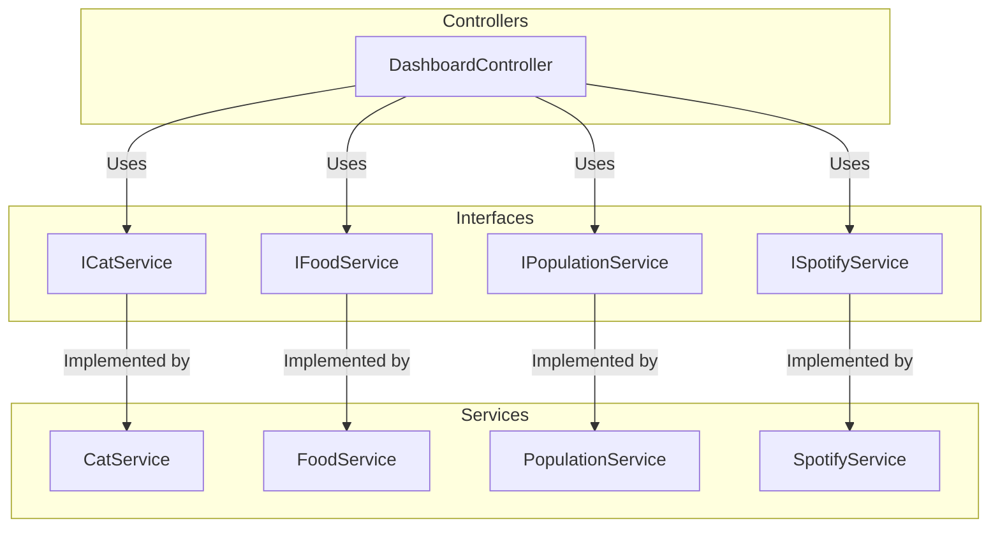

# API Integration - .NET 8

##### Table of Contents

1. [Setting up our project](#1-setting-up-our-project)
   - [Step 1: Setting Up OAuth Using Secret Manager](#step-1-setting-up-oauth-using-secret-manager)
   - [Step 2: Build the Project](#step-2-build-the-project)
2. [Project Structure and Design Patterns](#2-project-structure-and-design-patterns)
   - [Layered Architecture](#layered-architecture)
   - [Controllers](#controllers)
   - [Services](#services)
   - [Models](#models)
   - [Dependency Injection](#dependency-injection)
   - [Single Responsibility Principle (SRP)](#single-responsibility-principle-srp)
   - [Separation of Concerns](#separation-of-concerns)
3. [Endpoint Details](#endpoint-details)
   - [GET /data](#get-data)
   - [Request](#request)
   - [Response](#response)

## 1 Setting up our project 

###### Step 1: Setting Up OAuth Using Secret Manager

1. **Enable the Secret Manager** (if not already enabled):

    ```powershell
    dotnet user-secrets init
    ```

2. **Set up your Spotify ClientId and ClientSecret**:

    - Retrieve your `ClientId` and `ClientSecret` from your [Spotify Developer Dashboard](https://developer.spotify.com/dashboard/applications).
    - Once you have them, securely store them using the .NET Secret Manager with these commands:

    ```powershell

    # Initialize variables with your Spotify app credentials
    $client_id = "[ID HERE]"
    $client_secret = "[SECRET HERE]" 


    # Set ClientId using Secret Manager
    dotnet user-secrets set "OAuthSettings:ClientId" "$client_id" 


    # Set ClientSecret using Secret Manager
    dotnet user-secrets set "OAuthSettings:ClientSecret" "$client_secret"

    ```


---

###### Step 2: Build the Project

Once the secrets are set up, build the project to restore all necessary dependencies and ensure everything compiles properly:

```bash

dotnet build

```

## 2 Project Structure and Design Patterns


##### 1. Layered Architecture

The system is organised into layers that each have distinct responsibilities.



###### Controllers
The `DashBoardController.cs` in the API Aggregation project is responsible for handling API requests and aggregating data from multiple sources.
It relies on the following services `IPopulationService`, `IFoodService`, `ICatService`, and `ISpotifyService` to fetch data on population statistics, food, cat breeds, and Spotify playlists, respectively.
The `GetAggregatedData` method asynchronously gathers this information into a unified response.
Exception handling ensures that errors during data retrieval are logged and properly communicated.
By centralizing these operations, `DashBoardController` simplifies client interactions and provides a data aggregation endpoint.


###### Services
- **SpotifyService**: **Implements `ISpotifyService`** to interact with the Spotify API using OAuth for authentication.
Handles token management, API requests, and provides search results for artists or songs.
Includes advanced error handling and caching of tokens to optimize performance. 
**If errors occur, it returns a fallback result.**

- **CatBreedService**: Implements `ICatService` to fetch and process cat breed data from The Cat API.
Handles HTTP requests and logs errors. Returns a list of cat breeds with basic information or fallback data if the request fails.

- **FoodService**: Implements `IFoodService` to retrieve and parse food data from OpenFoodFacts.
Handles HTTP requests, logs issues, and provides a list of popular food items or fallback data in case of errors.

- **PopulationService**: Implements `IPopulationService` to obtain population statistics from DataUSA.
Manages HTTP requests, logs errors, and returns population data or default results if the API call fails.

###### Models
- **AggregatedData**: Combines data from various sources like population, food, cat breeds, and Spotify into a single structure for unified responses.

- **Cat**: Defines the structure for cat breed data, including breed name, origin, and temperament.

- **Food**: Represents food item data, including code, name, ingredients, and nutrition grades.

- **OAuthSettings**: Stores OAuth credentials and settings for Spotify API authentication.

- **Population**: Models population statistics, including nation, population count, and year.

- **Spotify**: Represents Spotify search results, including artist details and related metadata.

- **Token**: Manages OAuth tokens, including access token and expiration details for Spotify API.

###### Dependency Injection

Dependency Injection (DI) is employed to achieve loose coupling between components. Interfaces such as `ICatService`, `IFoodService`, `IPopulationService`, and `ISpotifyService` are defined and implemented in concrete classes like `CatService`, `FoodService`, `PopulationService`, and `SpotifyService`. The `AddScoped` method is used to register services, ensuring that each service is instantiated once per request. This design allows controllers to depend on interfaces rather than concrete implementations, facilitating easier testing and maintenance.

###### Single Responsibility Principle (SRP)

The Single Responsibility Principle (SRP) is adhered to, meaning that each class has a single reason to change, focusing on one responsibility:

- **Controllers** manage HTTP requests and responses.
- **Services** handle business logic and data source interactions.
- **Models** represent data entities.

This clear separation of responsibilities simplifies maintenance and enhances code clarity.


###### Separation of Concerns

The project is organized into distinct folders (Controllers, Models, Services) to ensure separation of concerns. Each component addresses a specific aspect of the application, which enhances the system’s clarity and maintainability.


###### Endpoint Details

##### GET /data

The `/data` endpoint is designed to aggregate various data types and provide them in a unified response. Below are the details of the endpoint:

###### Request

- **Method**: GET
- **URL**: `/data`
- **Headers**:
  - `Content-Type: application/json`


###### Response

- **Status Codes**:
  - `200 OK`: The request was successful, and the response contains the aggregated data.
  - `500 Internal Server Error`: An error occurred while processing the request. This may include details about the error in the response body.

- **Body**:
  - **Content-Type**: `application/json`
  - **Schema**:
    ```json
    {
      "population": [
        {
          "nation": "string",
          "population": "integer",
          "year": "string"
        }
      ],
      "food": [
        {
          "code": "string",
          "image_url": "string",
          "ingredients_text": "string",
          "nutrition_grades_tags": ["string"]
        }
      ],
      "cat": [
        {
          "name": "string",
          "origin": "string",
          "temperament": "string",
          "lifeSpan": "string",
          "description": "string"
        }
      ],
      "spotify": {
        "artists": {
          "items": [
            {
              "name": "string",
              "popularity": "integer",
              "images": [
                {
                  "url": "string"
                }
              ],
              "id": "string",
              "followers": {
                "total": "integer"
              }
            }
          ]
        }
      }
    }
    ```